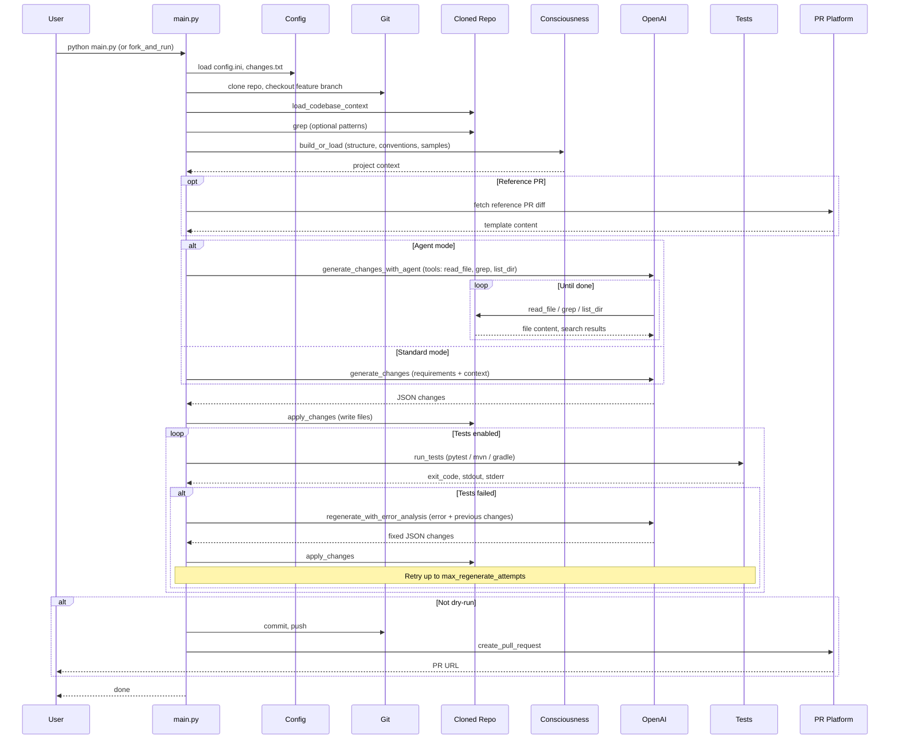

# Autonomous Code Generation

Autonomous code generation and feature building that integrates with **GitHub** and **Bitbucket**. The system can:

- Checkout code from a repository
- **Analyze** codebase (Python, Java) with optional grep search
- **Generate** changes based on requirements (using AI)
- **Agent mode** (optional): AI iteratively explores with `read_file`, `grep`, `list_dir`, `find_files` before generating
- **Run tests** (pytest/unittest for Python, Maven/Gradle for Java)
- **Error analysis → regenerate** when tests fail (up to N retries)
- Commit and push changes
- Create a Pull Request

## Sequence Diagram



## Quick Start

### 1. Install dependencies

```bash
pip install -r requirements.txt
```

### 2. Configure

```bash
cp config.example.ini config.ini
```

Edit **config.ini**:

```ini
[repository]
platform = github   # or bitbucket
repo_url = https://github.com/your-org/your-repo.git
base_branch = main

[github_config]
# Use environment variables (recommended)
use_env = true
```

Set environment variables:

```bash
# For GitHub
export GITHUB_TOKEN=your_personal_access_token

# For Bitbucket
export BITBUCKET_APP_PASSWORD=your_app_password

# For AI (required)
export OPENAI_API_KEY=your_openai_api_key
```

### 3. Define requirements

Edit **changes.txt** with your feature/code change requirements:

```
1. Add a validate_email function in utils.py
   - Use regex for validation
   - Return True/False

2. Add error handling to the main API handler
   - Log errors
   - Return 500 on failure
```

### 4. Run

```bash
# Dry run (analyze + generate, no push/PR)
python main.py --dry-run

# Full run (includes test → regenerate loop)
python main.py

# Agent mode: AI explores codebase with read_file, grep, list_dir before generating
python main.py --agent

# Skip tests (no test run, no regeneration)
python main.py --skip-tests
```

### Fork, fix issue, and publish

Fork an open source repo to your account, implement a feature/fix from `changes.txt`, and create a PR:

```bash
# Default: Dext3r-Morgan/beginner-friendly, adds factorial.py (references issue #31)
python fork_and_run.py

# Specific repo and issue
python fork_and_run.py Dext3r-Morgan/beginner-friendly --issue 31

# Java repo (maven-demo) - runs tests
python fork_and_run.py davidmoten/maven-demo --changes examples/changes/changes_java.txt --run-tests

# Generate BDD tests (Cucumber)
python fork_and_run.py owner/repo --changes examples/changes/changes_bdd.txt --testing-strategy bdd

# Use agent mode to explore codebase before generating
python fork_and_run.py owner/repo --agent

# Use a reference PR as template (for repetitive changes)
python fork_and_run.py owner/repo --reference-pr https://github.com/owner/repo/pull/123

# Another repo
python fork_and_run.py davidmoten/maven-demo --issue 5
```

Edit `changes.txt` before running to specify what to implement.

**Reference PR (repetitive changes):** When applying the same type of change across multiple repos, specify a reference PR:
- **In changes.txt:** Add `# Reference PR: https://github.com/owner/repo/pull/123` at the top
- **CLI:** `--reference-pr https://...`
- **config.ini:** `reference_pr = https://...` in `[workflow]`

The system fetches that PR's diff and description and uses it as a template.

The script will:
1. Fork the repo to your GitHub account
2. Clone your fork
3. Generate and apply changes (AI)
4. Commit, push, and create PR with "Fixes #N"

### Standalone tools

```bash
# Grep across repo (like Cursor's search)
python scripts/run_grep.py ./workspace/my-repo "validate_email"

# Run tests in isolation
python scripts/run_tests.py ./workspace/my-repo
```

For script execution and output verification, use `src.code_executor`:
- `run_python_script(path, cwd, timeout)` – run Python script, returns (exit_code, stdout, stderr)
- `run_java_main(repo_path, main_class)` – run Java main via Maven/Gradle
- `verify_output(actual, expected, exact)` – compare output

## Configuration Reference

### config.ini

| Section | Key | Description |
|---------|-----|-------------|
| repository | platform | `github` or `bitbucket` |
| repository | repo_url | Full HTTPS clone URL |
| repository | base_branch | Branch to branch from (default: main) |
| repository | feature_branch | Optional; auto-generated if empty |
| github_config | auth_token | Token; can use env vars instead |
| github_config | use_env | Use `GITHUB_TOKEN` / `BITBUCKET_APP_PASSWORD` |
| ai | api_key | OpenAI key; or `OPENAI_API_KEY` env |
| ai | model | Model (default: gpt-4o) |
| workflow | work_dir | Clone directory (default: ./workspace) |
| workflow | cleanup_after_pr | Delete workspace after PR |
| workflow | grep_patterns | Comma-separated patterns to search before AI |
| workflow | reference_pr | GitHub PR URL to use as template for repetitive changes |
| workflow | use_agent | Agent mode: AI explores with read_file, grep, list_dir (default: false) |
| testing | run_tests | Run tests after changes (default: true) |
| testing | max_regenerate_attempts | Retries on test failure (default: 3) |
| testing | test_timeout | Test timeout in seconds (default: 120) |
| testing | testing_strategy | Java testing strategy: bdd, contract, integration, unit, e2e, soap, auto (default: auto) |
| consciousness | backend | Storage: file or opensearch (default: file) |
| consciousness | cache_dir | Cache path relative to work_dir (default: .consciousness) |
| consciousness | max_age_hours | Rebuild cache when older (default: 24, 0 = always rebuild) |

### changes.txt

Plain text requirements. Be specific: file names, function names, and behavior help the AI produce better changes.

**Testing strategy (Java):** Add `# Testing strategy: bdd` (or `contract`, `integration`, `unit`, `e2e`, `soap`) at the top to guide AI-generated tests.

## GitHub Setup

1. Create a [Personal Access Token](https://github.com/settings/tokens) with `repo` scope
2. Set `GITHUB_TOKEN` environment variable

## Bitbucket Setup

1. Create an [App Password](https://bitbucket.org/account/settings/app-passwords/) with:
   - Repositories: Read, Write
   - Pull requests: Write
2. Set `BITBUCKET_APP_PASSWORD` environment variable
3. For private repos, ensure your Bitbucket username has access; the app password is used with `x-token-auth` as username

## Project Structure

```
code-autonomy/
├── config.ini          # Configuration
├── changes.txt         # Requirements input
├── examples/changes/   # Example changes (bdd, contract, integration, java, soap, springboot)
├── scripts/            # Standalone tools (run_grep, run_tests)
├── main.py             # Orchestrator
├── fork_and_run.py     # Fork repo → run main → create PR
├── run_grep.py         # Grep/search tool (standalone)
├── run_tests.py        # Test runner (standalone)
├── requirements.txt
├── src/
│   ├── config_loader.py
│   ├── git_ops.py
│   ├── pr_platform.py      # GitHub + Bitbucket
│   ├── code_analyzer.py    # AI changes + error regeneration
│   ├── agent_analyzer.py   # Agent loop with tool use
│   ├── agent_tools.py      # read_file, grep, list_dir, find_files
│   ├── code_search.py      # Grep across files
│   ├── code_executor.py    # Run Python/Java tests in isolation
│   ├── reference_pr.py     # Fetch reference PR for template
│   ├── project_consciousness.py # Project model, indexing, file/OpenSearch storage
│   ├── consciousness_opensearch.py # OpenSearch backend (optional)
│   ├── testing_strategies.py # BDD, Contract, Integration, Unit, E2E guidance
│   └── activity.py        # Spinners, status messages
└── workspace/          # Cloned repos (created at runtime)
```

## Workflow: Analyze → Change → Test → Regenerate

1. **Analyze** – Load codebase context, optionally run grep for patterns
2. **Change** – AI generates file changes from requirements (or in agent mode: explore with tools first, then generate)
3. **Apply** – Write changes to disk
4. **Test** – Run pytest (Python) or mvn test / gradle test (Java)
5. **On failure** – AI analyzes error output, regenerates fixes, retry (up to `max_regenerate_attempts`)
6. **On success** – Commit, push, create PR

### Agent Mode

With `--agent` or `use_agent = true`, the AI uses tools before generating:

- **read_file** – Read file contents (optionally a line range)
- **grep** – Search for regex pattern across code files
- **list_dir** – List directory contents
- **find_files** – Find files by extension or glob pattern

This Cursor-like flow lets the model explore the codebase iteratively before producing changes.

### Java Testing Strategies

When generating Java tests, specify a strategy to get the right framework and patterns:

| Strategy | Frameworks | Use case |
|----------|------------|----------|
| **bdd** | Cucumber, Gherkin | Behavior-driven scenarios (Given/When/Then) |
| **contract** | Pact, Spring Cloud Contract | API contract testing (consumer/provider) |
| **integration** | Spring Boot Test, TestContainers, REST Assured | Full-stack integration tests |
| **unit** | JUnit 5, Mockito, AssertJ | Isolated unit tests (default) |
| **e2e** | Selenium, Playwright | Browser-based end-to-end tests |
| **soap** | Spring WS, JAX-WS, CXF, WireMock | Legacy SOAP web service testing |
| **auto** | Inferred from requirements | Detects from keywords (cucumber, soap, etc.) |

**How to set:**
- **config.ini:** `testing_strategy = bdd` in `[testing]`
- **changes.txt:** `# Testing strategy: bdd` at the top
- **CLI:** `--testing-strategy bdd` or `-t bdd`

Example files: `examples/changes/changes_bdd.txt`, `changes_contract.txt`, `changes_integration.txt`, `changes_java.txt`, `changes_soap.txt`, `changes_springboot.txt`

### Project consciousness

The tool automatically builds and persists a project model on load (structure, conventions, representative samples). No explicit "learn from" instructions; the AI receives project context as part of the codebase.

- **Indexing:** On project load, walks the repo to extract structure, build tool, test framework, and code samples
- **Storage:** File backend (default) or OpenSearch. Cached under `{work_dir}/.consciousness/{repo_id}.json`
- **Cache:** Rebuilds when `max_age_hours` exceeded or `--rebuild-consciousness` is used
- **Config:** `[consciousness]` section in config.ini (`backend`, `cache_dir`, `max_age_hours`)

## Limitations (POC)

- Single commit per run
- No interactive conflict resolution
- AI output quality depends on requirements clarity
- Bitbucket: uses REST API; some advanced PR options may differ from GitHub
