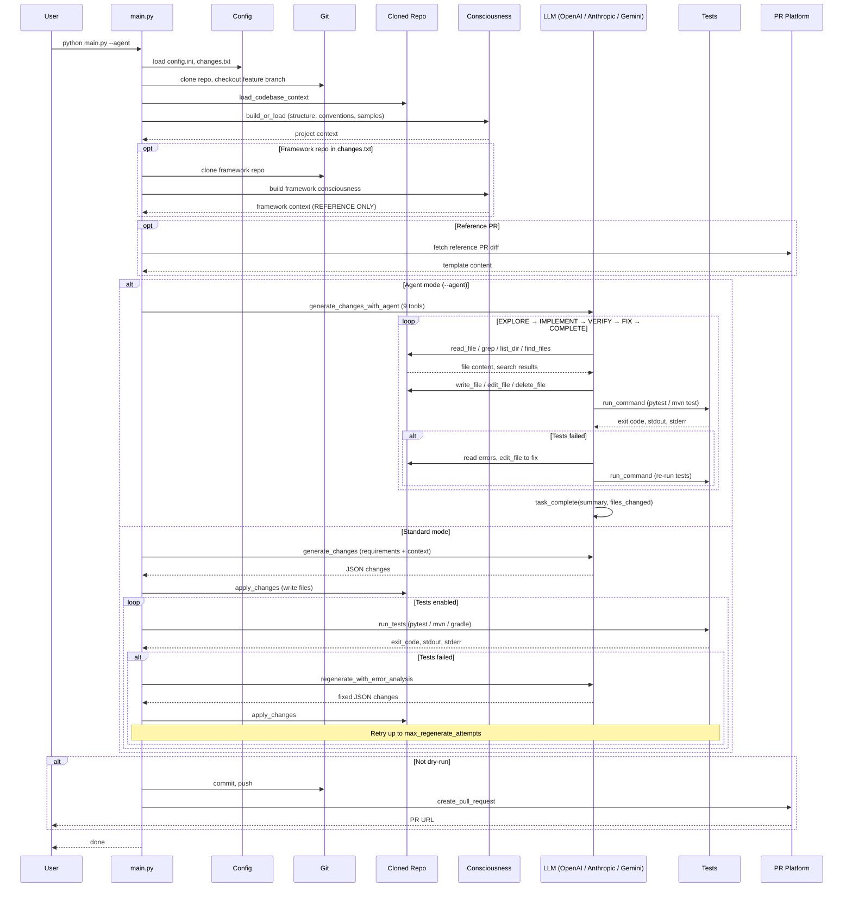

# Autonomous Code Generation

Autonomous code generation and feature building that integrates with **GitHub** and **Bitbucket**. The system can:

- Checkout code from a repository
- **Analyze** codebase (Python, Java) with optional grep search
- **Generate** changes based on requirements (using AI)
- **Agent mode** (Claude-Code-like): AI iteratively explores, edits, tests, and fixes code in a single agentic loop
- **Run tests** (pytest/unittest for Python, Maven/Gradle for Java)
- **Error analysis → regenerate** when tests fail (up to N retries)
- Commit and push changes
- Create a Pull Request

## Sequence Diagram



## Quick Start

### 1. Install dependencies

```bash
pip install -r requirements.txt
```

### 2. Configure

```bash
cp config.example.ini config.ini
```

Edit **config.ini**:

```ini
[repository]
platform = github   # or bitbucket
repo_url = https://github.com/your-org/your-repo.git
base_branch = main

[github_config]
# Use environment variables (recommended)
use_env = true
```

Set environment variables:

```bash
# For GitHub
export GITHUB_TOKEN=your_personal_access_token

# For Bitbucket
export BITBUCKET_APP_PASSWORD=your_app_password

# For AI (required) - use the key for your provider
export OPENAI_API_KEY=your_openai_api_key
# Or: ANTHROPIC_API_KEY, GEMINI_API_KEY for anthropic/gemini
```

### 3. Define requirements

Edit **changes.txt** with your feature/code change requirements:

```
1. Add a validate_email function in utils.py
   - Use regex for validation
   - Return True/False

2. Add error handling to the main API handler
   - Log errors
   - Return 500 on failure
```

### 4. Run

```bash
# Agent mode (recommended): AI explores, edits, tests, and fixes in a single loop
python main.py --agent

# Agent mode with dry run (no push/PR)
python main.py --agent --dry-run

# Standard mode (one-shot generation + external test/retry loop)
python main.py

# Dry run (analyze + generate, no push/PR)
python main.py --dry-run

# Skip tests (no test run, no regeneration)
python main.py --skip-tests
```

### Fork, fix issue, and publish

Fork an open source repo to your account, implement a feature/fix from `changes.txt`, and create a PR:

```bash
# Default: Dext3r-Morgan/beginner-friendly, adds factorial.py (references issue #31)
python fork_and_run.py

# Specific repo and issue
python fork_and_run.py Dext3r-Morgan/beginner-friendly --issue 31

# Java repo (maven-demo) - runs tests
python fork_and_run.py davidmoten/maven-demo --changes examples/changes/changes_java.txt --run-tests

# Generate BDD tests (Cucumber)
python fork_and_run.py owner/repo --changes examples/changes/changes_bdd.txt --testing-strategy bdd

# Use agent mode to explore, edit, test, and fix in a single loop
python fork_and_run.py owner/repo --agent

# Use a reference PR as template (for repetitive changes)
python fork_and_run.py owner/repo --reference-pr https://github.com/owner/repo/pull/123

# Another repo
python fork_and_run.py davidmoten/maven-demo --issue 5
```

Edit `changes.txt` before running to specify what to implement.

**Reference PR (repetitive changes):** When applying the same type of change across multiple repos, specify a reference PR:
- **In changes.txt:** Add `# Reference PR: https://github.com/owner/repo/pull/123` at the top
- **CLI:** `--reference-pr https://...`
- **config.ini:** `reference_pr = https://...` in `[workflow]`

The system fetches that PR's diff and description and uses it as a template.

**Framework repo (external reference):** When your app uses a custom framework in a separate repo, add at the top of `changes.txt`:

```
# Framework repo: https://github.com/your-org/acme-platform.git
# Framework branch: main
```

The tool clones the framework repo, builds consciousness from it, and injects it into the AI prompt as **REFERENCE ONLY** – the AI is instructed that framework code cannot be changed. Only application files are modified.

The script will:
1. Fork the repo to your GitHub account
2. Clone your fork
3. Generate and apply changes (AI)
4. Commit, push, and create PR with "Fixes #N"

### Standalone tools

```bash
# Grep across repo (like Cursor's search)
python scripts/run_grep.py ./workspace/my-repo "validate_email"

# Run tests in isolation
python scripts/run_tests.py ./workspace/my-repo
```

For script execution and output verification, use `src.code.executor`:
- `run_python_script(path, cwd, timeout)` – run Python script, returns (exit_code, stdout, stderr)
- `run_java_main(repo_path, main_class)` – run Java main via Maven/Gradle
- `verify_output(actual, expected, exact)` – compare output

## Configuration Reference

### config.ini

| Section | Key | Description |
|---------|-----|-------------|
| repository | platform | `github` or `bitbucket` |
| repository | repo_url | Full HTTPS clone URL |
| repository | base_branch | Branch to branch from (default: main) |
| repository | feature_branch | Optional; auto-generated if empty |
| github_config | auth_token | Token; can use env vars instead |
| github_config | use_env | Use `GITHUB_TOKEN` / `BITBUCKET_APP_PASSWORD` |
| ai | provider | LLM provider: openai, anthropic, gemini (default: openai) |
| ai | api_key | API key; or use api_key_env (OPENAI_API_KEY, ANTHROPIC_API_KEY, GEMINI_API_KEY) |
| ai | api_key_env | Env var for API key (optional override) |
| ai | model | Model (gpt-4o, claude-sonnet-4-5, gemini-1.5-pro, etc.) |
| ai | base_url | Optional: custom endpoint (Azure, proxy) |
| workflow | work_dir | Clone directory (default: ./workspace) |
| workflow | cleanup_after_pr | Delete workspace after PR |
| workflow | grep_patterns | Comma-separated patterns to search before AI |
| workflow | reference_pr | GitHub PR URL to use as template for repetitive changes |
| workflow | use_agent | Enable agent mode by default (default: false) |
| testing | run_tests | Run tests after changes (default: true) |
| testing | max_regenerate_attempts | Retries on test failure (default: 3) |
| testing | test_timeout | Test timeout in seconds (default: 120) |
| testing | testing_strategy | Java testing strategy: bdd, contract, integration, unit, e2e, soap, auto (default: auto) |
| **agent** | **max_turns** | **Max turns in the agent loop, each turn = one LLM call (default: 50)** |
| **agent** | **smart_summarization** | **Summarize large tool outputs with a fast LLM call instead of blind truncation (default: true)** |
| **agent** | **truncation_limit** | **Char limit per tool result before summarization kicks in (default: 30000)** |
| **agent** | **command_allowlist_only** | **Restrict shell commands to allowlist prefixes only (default: false)** |
| **agent** | **allowed_command_prefixes** | **Comma-separated allowed commands when allowlist mode is on (default: pytest,python,mvn,gradle,npm,npx)** |
| **agent** | **blocked_commands** | **Always-blocked dangerous commands (default: rm -rf /,mkfs,dd if=,shutdown,reboot)** |
| consciousness | backend | Storage: file or opensearch (default: file) |
| consciousness | cache_dir | Cache path relative to work_dir (default: .consciousness) |
| consciousness | max_age_hours | Rebuild cache when older (default: 24, 0 = always rebuild) |
| context | use_pipeline | Use modular context pipeline (default: false) |
| context | grep_enricher | Grep from requirements + config (default: true) |
| context | grep_from_requirements | Extract # Grep: and identifiers from requirements |
| context | similarity_enricher | Local embedding search (default: false) |
| context | call_graph_enricher | Include call-graph-related code (default: false) |

### changes.txt

Plain text requirements. Be specific: file names, function names, and behavior help the AI produce better changes.

**Testing strategy (Java):** Add `# Testing strategy: bdd` (or `contract`, `integration`, `unit`, `e2e`, `soap`) at the top to guide AI-generated tests.

**Framework repo:** Add `# Framework repo: https://github.com/org/repo.git` (and optionally `# Framework branch: main`) to clone an external framework and use it as reference. Framework code is REFERENCE ONLY – the AI will not modify it.

**Grep hints:** Add `# Grep: pattern1, pattern2` at the top to prioritize files matching those patterns (when `use_pipeline=true`).

### Context pipeline (modular context building)

Set `use_pipeline = true` in `[context]` to enable the modular pipeline:

| Enricher | Config | Description |
|----------|--------|-------------|
| Grep | `grep_enricher = true` | Grep from `# Grep:` in changes.txt, config `grep_patterns`, and auto-extracted identifiers |
| Similarity | `similarity_enricher = true` | Local embedding search (requires `sentence-transformers`) |
| Call graph | `call_graph_enricher = true` | Traverse call graph from seed files (Python; Java needs `javalang`) |

Optional deps: `pip install sentence-transformers` for similarity, `pip install javalang` for Java call graph.

### Multi-provider LLM (OpenAI, Anthropic, Gemini)

The LLM layer (`src/llm_client.py`) supports multiple providers via [LiteLLM](https://docs.litellm.ai/) with automatic retry (3 retries, exponential backoff) for transient errors (rate limits, timeouts, 5xx):

| Provider | config.ini | Model examples | Env var |
|----------|------------|----------------|---------|
| OpenAI | `provider = openai` | gpt-4o, gpt-4o-mini | OPENAI_API_KEY |
| Anthropic | `provider = anthropic` | claude-sonnet-4-5, claude-3-5-haiku | ANTHROPIC_API_KEY |
| Google | `provider = gemini` | gemini-1.5-pro, gemini-1.5-flash | GEMINI_API_KEY |

Set `api_key` in config or the corresponding env var. Use `base_url` for Azure or custom endpoints.

## GitHub Setup

1. Create a [Personal Access Token](https://github.com/settings/tokens) with `repo` scope
2. Set `GITHUB_TOKEN` environment variable

## Bitbucket Setup

1. Create an [App Password](https://bitbucket.org/account/settings/app-passwords/) with:
   - Repositories: Read, Write
   - Pull requests: Write
2. Set `BITBUCKET_APP_PASSWORD` environment variable
3. For private repos, ensure your Bitbucket username has access; the app password is used with `x-token-auth` as username

## Project Structure

```
code-autonomy/
├── config.ini          # Configuration
├── changes.txt         # Requirements input
├── examples/changes/   # Example changes (bdd, contract, integration, java, soap, springboot)
├── scripts/            # Standalone tools (run_grep, run_tests)
├── main.py             # Orchestrator
├── fork_and_run.py     # Fork repo → run main → create PR
├── requirements.txt
├── src/
│   ├── __init__.py
│   ├── constants.py         # Shared constants (extensions, skip dirs)
│   ├── config_loader.py     # Config loading and parsing
│   ├── llm_client.py        # Multi-provider LLM with retry logic (OpenAI, Anthropic, Gemini via LiteLLM)
│   │
│   ├── agent/               # Agent loop infrastructure
│   │   ├── analyzer.py      # Agent loop: explore → edit → test → fix → complete
│   │   ├── tools.py         # 9 agent tools (read, write, edit, delete, grep, list, find, run, complete)
│   │   ├── knowledge.py     # Persistent knowledge system (working memory, cross-run knowledge)
│   │   ├── context.py       # Smart context management (token-aware, summarization, compression)
│   │   ├── activity.py      # Spinners, status messages
│   │   └── ai_utils.py      # AI response parsing utilities
│   │
│   ├── code/                # Code analysis, search, and execution
│   │   ├── analyzer.py      # AI changes + error regeneration (standard mode)
│   │   ├── search.py        # Grep across files
│   │   ├── executor.py      # Run Python/Java tests in isolation
│   │   └── testing_strategies.py  # BDD, Contract, Integration, Unit, E2E, SOAP guidance
│   │
│   ├── consciousness/       # Project understanding and indexing
│   │   ├── core.py          # Project model, indexing, file storage
│   │   └── opensearch.py    # OpenSearch backend (optional)
│   │
│   ├── platform/            # VCS and PR integration
│   │   ├── git_ops.py       # Clone, checkout, commit, push
│   │   ├── pr_platform.py   # GitHub + Bitbucket PR creation
│   │   └── reference_pr.py  # Fetch reference PR for template
│   │
│   ├── context/             # Modular context pipeline (grep, similarity, call graph)
│   └── embeddings/          # Local embeddings for similarity search (optional)
└── workspace/          # Cloned repos (created at runtime)
```

## Workflow

### Standard Mode: Analyze → Change → Test → Regenerate

1. **Analyze** – Load codebase context, optionally run grep for patterns
2. **Change** – AI generates file changes from requirements as JSON
3. **Apply** – Write changes to disk
4. **Test** – Run pytest (Python) or mvn test / gradle test (Java)
5. **On failure** – AI analyzes error output, regenerates fixes, retry (up to `max_regenerate_attempts`)
6. **On success** – Commit, push, create PR

### Agent Mode (Claude-Code-like)

With `--agent` or `use_agent = true`, the AI operates in an autonomous agentic loop with 9 tools, directly exploring, editing, testing, and fixing code:

**Read tools (explore):**
| Tool | Description |
|------|-------------|
| `read_file` | Read file contents (optionally a line range) |
| `grep` | Search for regex pattern across code files |
| `list_dir` | List directory contents |
| `find_files` | Find files by extension or glob pattern |

**Write tools (modify):**
| Tool | Description |
|------|-------------|
| `write_file` | Create a new file or overwrite completely |
| `edit_file` | Surgical search-and-replace — find exact `old_string` (must be unique) and replace with `new_string` |
| `delete_file` | Delete a file |

**Execution tools:**
| Tool | Description |
|------|-------------|
| `run_command` | Run shell commands (tests, builds) sandboxed to the repo directory |

**Completion:**
| Tool | Description |
|------|-------------|
| `task_complete` | Signal that all changes are done and verified |

**Agent workflow:**
1. **EXPLORE** – Use read tools to understand the codebase structure, conventions, and relevant files
2. **IMPLEMENT** – Use `edit_file` for surgical edits to existing files, `write_file` for new files
3. **VERIFY** – Run tests with `run_command` (e.g., `pytest -v`, `mvn test`)
4. **FIX** – If tests fail, read error output, edit files, re-run tests
5. **COMPLETE** – Call `task_complete` with summary and list of changed files

**Key differences from standard mode:**
- Agent writes files **directly** during the loop — no external `apply_changes()` step
- Tests run **inside** the agent loop — no external test/retry loop needed
- Agent fixes errors **iteratively** — reads failures, edits code, re-runs tests
- **Stuck detection** — if the same test failure appears 3 times, the agent is nudged to try a different approach

### Smart Context Management

The agent uses intelligent context management (`src/agent/context.py`) to maximize the effectiveness of each LLM call:

**Token-aware context limits:**
- Per-model context windows: GPT-4o (128K), Claude (200K), Gemini (1M)
- Uses 80% of context window as safe limit
- Compresses conversation when approaching 70% capacity

**Intelligent summarization:**
- Large tool outputs (exceeding `truncation_limit`) are summarized by a fast/cheap LLM call instead of blindly truncated
- Uses fast models from the same provider (gpt-4o-mini, claude-3-5-haiku, gemini-1.5-flash)
- Preserves error messages, file paths, test results, and actionable information

**Context compression (for long conversations):**
- Always keeps: system prompt + initial user message + last 12 messages
- Middle messages: large tool results (>2KB) get intelligently summarized
- Progressive drop: oldest middle messages removed if still over limit

**Requirement-aware initial context:**
- Parses identifiers from `changes.txt` requirements (CamelCase, snake_case symbols)
- Uses grep to find files containing those identifiers
- Provides focused project overview (language, build tool, test framework, relevant files) instead of dumping raw code samples

### Java Testing Strategies

When generating Java tests, specify a strategy to get the right framework and patterns:

| Strategy | Frameworks | Use case |
|----------|------------|----------|
| **bdd** | Cucumber, Gherkin | Behavior-driven scenarios (Given/When/Then) |
| **contract** | Pact, Spring Cloud Contract | API contract testing (consumer/provider) |
| **integration** | Spring Boot Test, TestContainers, REST Assured | Full-stack integration tests |
| **unit** | JUnit 5, Mockito, AssertJ | Isolated unit tests (default) |
| **e2e** | Selenium, Playwright | Browser-based end-to-end tests |
| **soap** | Spring WS, JAX-WS, CXF, WireMock | Legacy SOAP web service testing |
| **auto** | Inferred from requirements | Detects from keywords (cucumber, soap, etc.) |

**How to set:**
- **config.ini:** `testing_strategy = bdd` in `[testing]`
- **changes.txt:** `# Testing strategy: bdd` at the top
- **CLI:** `--testing-strategy bdd` or `-t bdd`

Example files: `examples/changes/changes_bdd.txt`, `changes_contract.txt`, `changes_integration.txt`, `changes_java.txt`, `changes_soap.txt`, `changes_springboot.txt`

### Project consciousness

The tool automatically builds and persists a project model on load (structure, conventions, representative samples). No explicit "learn from" instructions; the AI receives project context as part of the codebase.

- **Indexing:** On project load, walks the repo to extract structure, build tool, test framework, and code samples
- **Storage:** File backend (default) or OpenSearch. Cached under `{work_dir}/.consciousness/{repo_id}.json`
- **Cache:** Rebuilds when `max_age_hours` exceeded or `--rebuild-consciousness` is used
- **Config:** `[consciousness]` section in config.ini (`backend`, `cache_dir`, `max_age_hours`)

## Limitations (POC)

- Single commit per run
- No interactive conflict resolution
- AI output quality depends on requirements clarity
- Bitbucket: uses REST API; some advanced PR options may differ from GitHub
