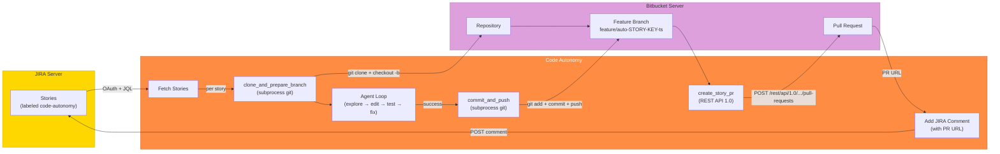
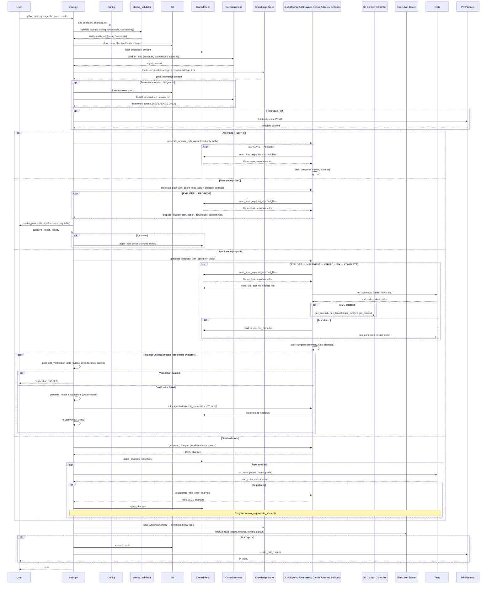

# Autonomous Code Generation

Autonomous code generation and feature building that integrates with **GitHub** and **Bitbucket**. The system can:

- Checkout code from a repository
- **Analyze** codebase (Python, Java) with optional grep search
- **Generate** changes based on requirements (using AI)
- **Agent mode** (Claude-Code-like): AI iteratively explores, edits, tests, and fixes code in a single agentic loop
- **Plan mode**: AI proposes diffs for human review before applying changes
- **Ask mode**: read-only Q&A exploration of a codebase
- **Run tests** (pytest/unittest for Python, Maven/Gradle for Java)
- **Error analysis → regenerate** when tests fail (up to N retries)
- **Persistent knowledge** across runs (working memory + cross-run knowledge entries)
- **Git Context Controller (GCC)**: structured versioned memory with commit/branch/merge semantics
- **Execution tracing**: span-level telemetry with reward signals (RL-ready)
- **Resiliency**: circuit breaker and token-bucket rate limiter for LLM calls
- **Pre-flight validation**: startup checks for config, credentials, and connectivity
- **Repo knowledge files**: `.code-autonomy/`, `.code-autonomy.md`, or `AGENT.md` for project-specific agent instructions
- **Code Intelligence (CodeIndex)**: symbol table, dependency graph, class hierarchy, entity embeddings, 7 agent tools
- **Pre-edit context assembly** (`context_for_edit`): Graph-RAG context — callers, callees, dependents, hierarchy, tests — before any edit
- **Breakage prediction** (`predict_breakage`): per-symbol risk report (HIGH/MEDIUM/LOW) with caller/child/dependent analysis before changes
- **Verify-and-repair loop**: post-edit verification gate with graph-aware repair suggestions and automatic agent retry
- Commit and push changes
- Create a Pull Request

## Architecture



```mermaid
graph TB
    subgraph Entry["Entry Points"]
        CLI["main.py<br/>(Orchestrator)"]
        Fork["fork_and_run.py"]
    end

    subgraph Config["Configuration"]
        CL["config_loader.py<br/>config.ini + env vars"]
        SV["startup_validator.py<br/>Pre-flight checks"]
    end

    subgraph Modes["Execution Modes"]
        STD["Standard Mode<br/>One-shot generation + test/retry"]
        AGT["Agent Mode (--agent)<br/>Explore → Edit → Test → Fix loop"]
        PLN["Plan Mode (--plan)<br/>Propose diffs → Review → Apply"]
        ASK["Ask Mode (--ask)<br/>Read-only Q&A"]
        JIRA["JIRA Mode (--jira)<br/>Process stories → Branch → PR"]
    end

    subgraph Agent["Agent Loop (src/agent/)"]
        ANA["analyzer.py<br/>Turn-based agent loop"]
        TLS["tools.py<br/>9 base tools: read, write,<br/>edit, delete, grep, list,<br/>find, run_command, task_complete"]
        MEM["knowledge.py<br/>Working memory +<br/>cross-run persistence"]
        GCC["gcc.py<br/>Git Context Controller<br/>commit/branch/merge"]
        TRC["tracing.py<br/>Execution spans +<br/>reward signals"]
        ACT["activity.py<br/>Spinners + logging"]
        PLM["plan.py + plan_display.py<br/>Propose changes + diff render"]
    end

    subgraph CodeIntel["Code Intelligence (src/code_index/)"]
        CIS["storage.py<br/>Build / load / cache"]
        SYM["symbol_table.py<br/>AST → functions, classes"]
        IMP["import_resolver.py<br/>Cross-file imports"]
        GRB["graph_builder.py<br/>Bidirectional call graph"]
        HIR["hierarchy.py<br/>Class inheritance"]
        EMB["entity_embeddings.py<br/>Semantic vectors"]
        CIT["tools.py<br/>7 tools: find_callers,<br/>find_dependents, impact_analysis,<br/>context_for_edit, predict_breakage"]
        VER["verifier.py<br/>Post-edit verification gate"]
    end

    subgraph Understand["Project Understanding"]
        CON["consciousness/core.py<br/>Structure, conventions,<br/>samples, frameworks"]
        CTX["context/pipeline.py<br/>Grep + similarity + call graph"]
        RK["Repo Knowledge<br/>.code-autonomy.md / AGENT.md"]
    end

    subgraph LLM["LLM Layer"]
        LLC["llm_client.py<br/>Multi-provider unified API"]
        RES["resiliency.py<br/>Circuit breaker +<br/>rate limiter"]
        OAI["OpenAI"]
        ANT["Anthropic"]
        GEM["Gemini"]
        AZR["Azure OpenAI"]
        BED["AWS Bedrock"]
    end

    subgraph Platform["VCS & PR (src/platform/)"]
        GIT["git_ops.py<br/>Clone, checkout, commit,<br/>push (subprocess)"]
        PRP["pr_platform.py<br/>GitHub / Bitbucket /<br/>Bitbucket Server PR"]
        BBS["bitbucket_server.py<br/>REST API 1.0 client"]
        REF["reference_pr.py<br/>Fetch template PR"]
    end

    subgraph JiraInt["JIRA Integration (src/jira/)"]
        JCL["client.py<br/>OAuth, search, comment,<br/>transition"]
        JSS["session.py<br/>Persistent JiraSession<br/>(resume support)"]
        BBR["bitbucket_bridge.py<br/>clone_and_prepare_branch<br/>commit_and_push"]
    end

    subgraph CodeGen["Standard Code Gen (src/code/)"]
        SAN["analyzer.py<br/>One-shot LLM generation"]
        EXE["executor.py<br/>pytest / Maven / Gradle"]
        TST["testing_strategies.py<br/>BDD, Contract, Unit, E2E, SOAP"]
    end

    %% Entry → Config
    CLI --> CL
    CLI --> SV
    Fork --> CLI

    %% Config → Modes
    CL --> STD
    CL --> AGT
    CL --> PLN
    CL --> ASK
    CL --> JIRA

    %% Modes → Components
    STD --> SAN
    STD --> EXE
    AGT --> ANA
    PLN --> ANA
    ASK --> ANA
    JIRA --> JCL
    JIRA --> ANA

    %% Agent internals
    ANA --> TLS
    ANA --> MEM
    ANA --> GCC
    ANA --> TRC
    ANA --> ACT
    ANA --> PLM
    ANA --> CIT

    %% Agent → LLM
    ANA --> LLC
    SAN --> LLC
    LLC --> RES
    RES --> OAI
    RES --> ANT
    RES --> GEM
    RES --> AZR
    RES --> BED

    %% Understanding
    CLI --> CON
    CLI --> RK
    STD --> CTX
    ANA --> CON

    %% Code Intelligence
    CIS --> SYM
    CIS --> IMP
    CIS --> GRB
    CIS --> HIR
    CIS --> EMB
    CIT --> CIS
    VER --> CIS
    ANA --> VER

    %% Platform
    CLI --> GIT
    CLI --> PRP
    PRP --> BBS
    CLI --> REF

    %% JIRA flow
    JCL --> JSS
    JIRA --> BBR
    BBR --> GIT
    BBR --> BBS

    %% Styling
    classDef entry fill:#4A90D9,stroke:#2C5F8A,color:#fff
    classDef mode fill:#7B68EE,stroke:#5A4BC6,color:#fff
    classDef agent fill:#FF8C42,stroke:#CC6E33,color:#fff
    classDef intel fill:#50C878,stroke:#3A9659,color:#fff
    classDef llm fill:#FF6B6B,stroke:#CC5555,color:#fff
    classDef platform fill:#DDA0DD,stroke:#A97BA9,color:#000
    classDef jira fill:#FFD700,stroke:#CCB000,color:#000
    classDef understand fill:#87CEEB,stroke:#6BA3BD,color:#000
    classDef codegen fill:#F5DEB3,stroke:#C4B08F,color:#000

    class CLI,Fork entry
    class STD,AGT,PLN,ASK,JIRA mode
    class ANA,TLS,MEM,GCC,TRC,ACT,PLM agent
    class CIS,SYM,IMP,GRB,HIR,EMB,CIT,VER intel
    class LLC,RES,OAI,ANT,GEM,AZR,BED llm
    class GIT,PRP,BBS,REF platform
    class JCL,JSS,BBR jira
    class CON,CTX,RK understand
    class SAN,EXE,TST codegen
    class CL,SV entry
```

### JIRA + Bitbucket Server Flow



## Sequence Diagram



## Quick Start

### 1. Install dependencies

```bash
pip install -r requirements.txt
```

### 2. Configure

```bash
cp config.example.ini config.ini
```

Edit **config.ini**:

```ini
[repository]
platform = github   # or bitbucket
repo_url = https://github.com/your-org/your-repo.git
base_branch = main

[github_config]
# Use environment variables (recommended)
use_env = true
```

Set environment variables:

```bash
# For GitHub
export GITHUB_TOKEN=your_personal_access_token

# For Bitbucket
export BITBUCKET_APP_PASSWORD=your_app_password

# For AI (required) - use the key for your provider
export OPENAI_API_KEY=your_openai_api_key
# Or: ANTHROPIC_API_KEY, GEMINI_API_KEY for anthropic/gemini
```

### 3. Define requirements

Edit **changes.txt** with your feature/code change requirements:

```
1. Add a validate_email function in utils.py
   - Use regex for validation
   - Return True/False

2. Add error handling to the main API handler
   - Log errors
   - Return 500 on failure
```

### 4. Run

```bash
# Agent mode (recommended): AI explores, edits, tests, and fixes in a single loop
python main.py --agent

# Agent mode with dry run (no push/PR)
python main.py --agent --dry-run

# Plan mode: AI proposes diffs for review before applying
python main.py --plan

# Plan mode with auto-approve (skip interactive review)
python main.py --plan --auto-approve

# Ask mode: read-only Q&A about the codebase
python main.py --ask "How does authentication work?"
python main.py -q "Where are the API routes defined?"

# Init knowledge: auto-generate .code-autonomy.md from project analysis
python main.py --init-knowledge --repo-path /path/to/repo

# Standard mode (one-shot generation + external test/retry loop)
python main.py

# Dry run (analyze + generate, no push/PR)
python main.py --dry-run

# Skip tests (no test run, no regeneration)
python main.py --skip-tests
```

### Fork, fix issue, and publish

Fork an open source repo to your account, implement a feature/fix from `changes.txt`, and create a PR:

```bash
# Default: Dext3r-Morgan/beginner-friendly, adds factorial.py (references issue #31)
python fork_and_run.py

# Specific repo and issue
python fork_and_run.py Dext3r-Morgan/beginner-friendly --issue 31

# Java repo (maven-demo) - runs tests
python fork_and_run.py davidmoten/maven-demo --changes examples/changes/changes_java.txt --run-tests

# Generate BDD tests (Cucumber)
python fork_and_run.py owner/repo --changes examples/changes/changes_bdd.txt --testing-strategy bdd

# Use agent mode to explore, edit, test, and fix in a single loop
python fork_and_run.py owner/repo --agent

# Use a reference PR as template (for repetitive changes)
python fork_and_run.py owner/repo --reference-pr https://github.com/owner/repo/pull/123

# Another repo
python fork_and_run.py davidmoten/maven-demo --issue 5
```

Edit `changes.txt` before running to specify what to implement.

**Reference PR (repetitive changes):** When applying the same type of change across multiple repos, specify a reference PR:
- **In changes.txt:** Add `# Reference PR: https://github.com/owner/repo/pull/123` at the top
- **CLI:** `--reference-pr https://...`
- **config.ini:** `reference_pr = https://...` in `[workflow]`

The system fetches that PR's diff and description and uses it as a template.

**Framework repo (external reference):** When your app uses a custom framework in a separate repo, add at the top of `changes.txt`:

```
# Framework repo: https://github.com/your-org/acme-platform.git
# Framework branch: main
```

The tool clones the framework repo, builds consciousness from it, and injects it into the AI prompt as **REFERENCE ONLY** – the AI is instructed that framework code cannot be changed. Only application files are modified.

The script will:
1. Fork the repo to your GitHub account
2. Clone your fork
3. Generate and apply changes (AI)
4. Commit, push, and create PR with "Fixes #N"

### Standalone tools

```bash
# Grep across repo (like Cursor's search)
python scripts/run_grep.py ./workspace/my-repo "validate_email"

# Run tests in isolation
python scripts/run_tests.py ./workspace/my-repo
```

For script execution and output verification, use `src.code.executor`:
- `run_python_script(path, cwd, timeout)` – run Python script, returns (exit_code, stdout, stderr)
- `run_java_main(repo_path, main_class)` – run Java main via Maven/Gradle
- `verify_output(actual, expected, exact)` – compare output

## Configuration Reference

### config.ini

| Section | Key | Description |
|---------|-----|-------------|
| repository | platform | `github` or `bitbucket` |
| repository | repo_url | Full HTTPS clone URL |
| repository | base_branch | Branch to branch from (default: main) |
| repository | feature_branch | Optional; auto-generated if empty |
| github_config | auth_token | Token; can use env vars instead |
| github_config | use_env | Use `GITHUB_TOKEN` / `BITBUCKET_APP_PASSWORD` |
| ai | provider | LLM provider: `openai`, `anthropic`, `gemini`, `azure`, `bedrock`, `cdao` (default: openai) |
| ai | api_key | API key (or use env var — see api_key_env) |
| ai | api_key_env | Override env var name for API key (default: auto per provider) |
| ai | model | Model name or ARN (gpt-4o, claude-sonnet-4-5, gemini-1.5-pro, etc.) |
| ai | base_url | Optional: custom endpoint URL |
| ai | verbose | Log verbose LLM details (default: false) |
| ai | endpoint | **Azure only:** Azure OpenAI endpoint URL |
| ai | deployment_name | **Azure only:** Azure deployment name |
| ai | api_version | **Azure only:** API version (default: 2024-02-15-preview) |
| ai | tenant_id | **Azure only:** Tenant ID for certificate auth |
| ai | client_id | **Azure only:** Client ID for certificate auth |
| ai | scope | **Azure only:** OAuth scope (default: cognitiveservices) |
| ai | s3_bucket_name | **Azure cert auth:** S3 bucket containing the certificate |
| ai | azure_cert_file_name | **Azure cert auth:** Certificate file key in S3 |
| ai | aws_account_number | **Bedrock/cdao only:** AWS account number |
| ai | aws_region | **Bedrock/cdao only:** AWS region (default: us-east-1) |
| ai | workspace_id | **Bedrock/cdao only:** Workspace ID |
| ai | is_execution_role | **Bedrock/cdao only:** Use execution role (default: false) |
| workflow | work_dir | Clone directory (default: ./workspace) |
| workflow | cleanup_after_pr | Delete workspace after PR |
| workflow | grep_patterns | Comma-separated patterns to search before AI |
| workflow | reference_pr | GitHub PR URL to use as template for repetitive changes |
| workflow | use_agent | Enable agent mode by default (default: false) |
| testing | run_tests | Run tests after changes (default: true) |
| testing | max_regenerate_attempts | Retries on test failure (default: 3) |
| testing | test_timeout | Test timeout in seconds (default: 120) |
| testing | testing_strategy | Java testing strategy: bdd, contract, integration, unit, e2e, soap, auto (default: auto) |
| **agent** | **max_turns** | **Max turns in the agent loop, each turn = one LLM call (default: 50)** |
| **agent** | **plan_max_turns** | **Max turns in plan mode (default: 30)** |
| **agent** | **ask_max_turns** | **Max turns in ask mode (default: 20)** |
| **agent** | **smart_summarization** | **Summarize large tool outputs with a fast LLM call instead of blind truncation (default: true)** |
| **agent** | **truncation_limit** | **Char limit per tool result before summarization kicks in (default: 30000)** |
| **agent** | **show_activity** | **Show spinner and status messages during agent loop (default: true)** |
| **agent** | **command_allowlist_only** | **Restrict shell commands to allowlist prefixes only (default: false)** |
| **agent** | **allowed_command_prefixes** | **Comma-separated allowed commands when allowlist mode is on (default: pytest,python,mvn,gradle,npm,npx)** |
| **agent** | **blocked_commands** | **Always-blocked dangerous commands (default: rm -rf /,mkfs,dd if=,shutdown,reboot)** |
| **agent** | **gcc_enabled** | **Enable Git Context Controller for structured memory (default: false)** |
| **agent** | **gcc_storage_dir** | **GCC state directory (default: ~/.code-autonomy/gcc)** |
| **agent** | **circuit_breaker_threshold** | **Consecutive LLM failures before circuit opens (default: 5)** |
| **agent** | **circuit_breaker_timeout** | **Seconds before half-open probe after circuit opens (default: 60)** |
| **agent** | **rate_limit_max_tokens** | **Token bucket capacity for LLM call rate limiting (default: 10)** |
| **agent** | **rate_limit_refill_rate** | **Tokens refilled per second (default: 1.0)** |
| consciousness | backend | Storage: file or opensearch (default: file) |
| consciousness | cache_dir | Cache path relative to work_dir (default: .consciousness) |
| consciousness | max_age_hours | Rebuild cache when older (default: 24, 0 = always rebuild) |
| **knowledge** | **backend** | **Storage backend: `file` or `opensearch` (default: file)** |
| **knowledge** | **storage_dir** | **Persistent knowledge directory (default: ~/.code-autonomy/knowledge)** |
| **knowledge** | **opensearch_url** | **OpenSearch endpoint URL (when backend = opensearch)** |
| **knowledge** | **opensearch_index** | **OpenSearch index name (default: agent_knowledge)** |
| **knowledge** | **aws_region** | **AWS region for OpenSearch SigV4 auth** |
| **tracing** | **enabled** | **Enable execution tracing (default: true)** |
| **tracing** | **storage_dir** | **Trace file directory (default: ~/.code-autonomy/traces)** |
| context | use_pipeline | Use modular context pipeline (default: false) |
| context | grep_enricher | Grep from requirements + config (default: true) |
| context | grep_from_requirements | Extract # Grep: and identifiers from requirements |
| context | similarity_enricher | Local embedding search (default: false) |
| context | call_graph_enricher | Include call-graph-related code (default: false) |

### changes.txt

Plain text requirements. Be specific: file names, function names, and behavior help the AI produce better changes.

**Testing strategy (Java):** Add `# Testing strategy: bdd` (or `contract`, `integration`, `unit`, `e2e`, `soap`) at the top to guide AI-generated tests.

**Framework repo:** Add `# Framework repo: https://github.com/org/repo.git` (and optionally `# Framework branch: main`) to clone an external framework and use it as reference. Framework code is REFERENCE ONLY – the AI will not modify it.

**Grep hints:** Add `# Grep: pattern1, pattern2` at the top to prioritize files matching those patterns (when `use_pipeline=true`).

### Context pipeline (modular context building)

Set `use_pipeline = true` in `[context]` to enable the modular pipeline:

| Enricher | Config | Description |
|----------|--------|-------------|
| Grep | `grep_enricher = true` | Grep from `# Grep:` in changes.txt, config `grep_patterns`, and auto-extracted identifiers |
| Similarity | `similarity_enricher = true` | Local embedding search (requires `sentence-transformers`) |
| Call graph | `call_graph_enricher = true` | Traverse call graph from seed files (Python; Java needs `javalang`) |

Optional deps: `pip install sentence-transformers` for similarity, `pip install javalang` for Java call graph.

### Multi-provider LLM

The LLM layer (`src/llm_client.py`) supports multiple providers with automatic retry (3 retries, exponential backoff) for transient errors (rate limits, timeouts, 5xx). All provider configuration lives in a single `[ai]` section — you only fill in the fields relevant to your chosen provider.

| Provider | `provider =` | Model examples | Auth |
|----------|------------|----------------|------|
| OpenAI | `openai` | gpt-4o, gpt-4o-mini | `OPENAI_API_KEY` env var or `api_key` in config |
| Anthropic | `anthropic` | claude-sonnet-4-5, claude-3-5-haiku | `ANTHROPIC_API_KEY` env var or `api_key` in config |
| Google | `gemini` | gemini-1.5-pro, gemini-1.5-flash | `GEMINI_API_KEY` env var or `api_key` in config |
| Azure OpenAI | `azure` | gpt-4o (via deployment) | `api_key` in config or S3 certificate auth |
| AWS Bedrock | `bedrock` / `cdao` | Bedrock model ARN | AWS account + workspace via cdao |

OpenAI, Anthropic, and Gemini use [LiteLLM](https://docs.litellm.ai/) under the hood. Azure and Bedrock use dedicated clients.

#### OpenAI / Anthropic / Gemini

Set the provider, model, and API key (via env var or config):

```ini
[ai]
provider = openai
model = gpt-4o
# api_key = sk-... (or set OPENAI_API_KEY env var)
```

#### Azure OpenAI

Azure requires `endpoint` and `deployment_name` in addition to the provider. Authentication is either API key or certificate-based (cert stored in S3).

**API key auth:**

```ini
[ai]
provider = azure
model = gpt-4o
endpoint = https://your-resource.openai.azure.com/
deployment_name = your-deployment-name
api_version = 2024-02-15-preview
api_key = your-azure-api-key
```

**Certificate auth (cert from S3):**

```ini
[ai]
provider = azure
model = gpt-4o
endpoint = https://your-resource.openai.azure.com/
deployment_name = your-deployment-name
api_version = 2024-02-15-preview
tenant_id = your-tenant-id
client_id = your-client-id
scope = https://cognitiveservices.azure.com/.default
s3_bucket_name = your-s3-bucket
azure_cert_file_name = path/to/cert.pem
```

Certificate auth loads the PEM certificate from S3, then obtains an Azure access token using `azure.identity.CertificateCredential`. Requires `boto3` and `azure-identity` packages.

#### AWS Bedrock (cdao)

Uses the org `cdao.bedrock_byoa_invoke_model` for Claude on Bedrock:

```ini
[ai]
provider = bedrock
model = arn:aws:bedrock:us-east-1:ACCOUNT:application-inference-profile/PROFILE_ID
aws_account_number = 098034167131
aws_region = us-east-1
workspace_id = 904071
is_execution_role = false
```

Requires the internal `cdao` package.

## GitHub Setup

1. Create a [Personal Access Token](https://github.com/settings/tokens) with `repo` scope
2. Set `GITHUB_TOKEN` environment variable

## Bitbucket Setup

1. Create an [App Password](https://bitbucket.org/account/settings/app-passwords/) with:
   - Repositories: Read, Write
   - Pull requests: Write
2. Set `BITBUCKET_APP_PASSWORD` environment variable
3. For private repos, ensure your Bitbucket username has access; the app password is used with `x-token-auth` as username

## Project Structure

```
code-autonomy/
├── config.ini          # Configuration
├── changes.txt         # Requirements input
├── examples/changes/   # Example changes (bdd, contract, integration, java, soap, springboot)
├── scripts/            # Standalone tools (run_grep, run_tests)
├── main.py             # Orchestrator (agent / plan / ask / standard modes)
├── fork_and_run.py     # Fork repo → run main → create PR
├── requirements.txt
├── src/
│   ├── __init__.py
│   ├── constants.py         # Shared constants (extensions, skip dirs)
│   ├── config_loader.py     # Config loading and parsing
│   ├── llm_client.py        # Multi-provider LLM with retry logic (OpenAI, Anthropic, Gemini, Azure, Bedrock)
│   ├── azure_openai_client.py  # Azure OpenAI client (API key or S3 certificate auth)
│   ├── resiliency.py        # Circuit breaker + token-bucket rate limiter
│   ├── startup_validator.py # Pre-flight validation (config, credentials, connectivity)
│   │
│   ├── agent/               # Agent loop infrastructure
│   │   ├── analyzer.py      # Agent loop: explore → edit → test → fix → complete (+ ask mode)
│   │   ├── tools.py         # 9 agent tools (read, write, edit, delete, grep, list, find, run, complete)
│   │   ├── plan.py          # Plan mode: propose_change → diff generation → apply_plan
│   │   ├── plan_display.py  # Rich-based colored diff rendering + approval prompt
│   │   ├── knowledge.py     # Persistent knowledge system (working memory, cross-run knowledge)
│   │   ├── gcc.py           # Git Context Controller (commit, branch, merge, context)
│   │   ├── tracing.py       # Execution tracing (spans, metrics, reward signals)
│   │   ├── context.py       # Smart context management (token-aware, summarization, compression)
│   │   ├── activity.py      # Spinners, status messages
│   │   └── ai_utils.py      # AI response parsing utilities
│   │
│   ├── code/                # Code analysis, search, and execution
│   │   ├── analyzer.py      # AI changes + error regeneration (standard mode)
│   │   ├── search.py        # Grep across files
│   │   ├── executor.py      # Run Python/Java tests in isolation
│   │   └── testing_strategies.py  # BDD, Contract, Integration, Unit, E2E, SOAP guidance
│   │
│   ├── code_index/          # Precision code intelligence (Graph-RAG)
│   │   ├── __init__.py      # Public API (CodeIndex, tools, verifier)
│   │   ├── storage.py       # CodeIndex dataclass + build / load / cache
│   │   ├── symbol_table.py  # AST-based symbol extraction (functions, classes, methods)
│   │   ├── import_resolver.py # Cross-file import resolution
│   │   ├── graph_builder.py # Bidirectional call graph + file dependency maps
│   │   ├── hierarchy.py     # Class hierarchy (parents, children, ancestors, descendants)
│   │   ├── entity_embeddings.py # Semantic embeddings for code entities
│   │   ├── tools.py         # 7 agent tools (find_callers, find_dependents, impact_analysis, describe_entity, find_similar, context_for_edit, predict_breakage)
│   │   └── verifier.py      # Post-edit verification gate + repair suggestions
│   │
│   ├── consciousness/       # Project understanding and indexing
│   │   ├── core.py          # Project model, indexing, file storage
│   │   └── opensearch.py    # OpenSearch backend (optional)
│   │
│   ├── platform/            # VCS and PR integration
│   │   ├── git_ops.py       # Clone, checkout, commit, push
│   │   ├── pr_platform.py   # GitHub + Bitbucket PR creation
│   │   └── reference_pr.py  # Fetch reference PR for template
│   │
│   ├── context/             # Modular context pipeline (grep, similarity, call graph)
│   └── embeddings/          # Local embeddings for similarity search (optional)
└── workspace/          # Cloned repos (created at runtime)
```

## Workflow

### Standard Mode: Analyze → Change → Test → Regenerate

1. **Analyze** – Load codebase context, optionally run grep for patterns
2. **Change** – AI generates file changes from requirements as JSON
3. **Apply** – Write changes to disk
4. **Test** – Run pytest (Python) or mvn test / gradle test (Java)
5. **On failure** – AI analyzes error output, regenerates fixes, retry (up to `max_regenerate_attempts`)
6. **On success** – Commit, push, create PR

### Agent Mode (Claude-Code-like)

With `--agent` or `use_agent = true`, the AI operates in an autonomous agentic loop with 9 tools, directly exploring, editing, testing, and fixing code:

**Read tools (explore):**
| Tool | Description |
|------|-------------|
| `read_file` | Read file contents (optionally a line range) |
| `grep` | Search for regex pattern across code files |
| `list_dir` | List directory contents |
| `find_files` | Find files by extension or glob pattern |

**Write tools (modify):**
| Tool | Description |
|------|-------------|
| `write_file` | Create a new file or overwrite completely |
| `edit_file` | Surgical search-and-replace — find exact `old_string` (must be unique) and replace with `new_string` |
| `delete_file` | Delete a file |

**Execution tools:**
| Tool | Description |
|------|-------------|
| `run_command` | Run shell commands (tests, builds) sandboxed to the repo directory |

**Completion:**
| Tool | Description |
|------|-------------|
| `task_complete` | Signal that all changes are done and verified |

**Code intelligence tools** (available when code index is built):

| Tool | Description |
|------|-------------|
| `find_callers` | Find all callers of a function/method/class |
| `find_dependents` | Find all files that import from a given file |
| `impact_analysis` | Callers + dependents + related tests for a file |
| `describe_entity` | Full signature, docstring, callers, callees, hierarchy |
| `find_similar` | Semantic search across all code entities |
| `context_for_edit` | **Pre-edit context** — callers, callees, dependents, hierarchy, tests, similar code |
| `predict_breakage` | **Risk report** — per-symbol HIGH/MEDIUM/LOW risk with caller/child/dependent warnings |

**Agent workflow:**
1. **EXPLORE** – Use read tools to understand the codebase structure, conventions, and relevant files
2. **ASSESS** – Use `context_for_edit` and `predict_breakage` to understand edit impact before changing code
3. **IMPLEMENT** – Use `edit_file` for surgical edits to existing files, `write_file` for new files
4. **VERIFY** – Run tests with `run_command` (e.g., `pytest -v`, `mvn test`)
5. **FIX** – If tests fail, read error output, edit files, re-run tests
6. **COMPLETE** – Call `task_complete` with summary and list of changed files

**Key differences from standard mode:**
- Agent writes files **directly** during the loop — no external `apply_changes()` step
- Tests run **inside** the agent loop — no external test/retry loop needed
- Agent fixes errors **iteratively** — reads failures, edits code, re-runs tests
- **Stuck detection** — if the same test failure appears 3 times, the agent is nudged to try a different approach

### Plan Mode

With `--plan` (or `-p`), the agent operates in a **two-phase** workflow: first it explores and proposes changes as diffs, then the user reviews and approves before anything is written to disk.

**Phase 1 — Explore & Propose:**

The agent has the same read tools as agent mode (`read_file`, `grep`, `list_dir`, `find_files`) plus one additional tool:

| Tool | Description |
|------|-------------|
| `propose_change` | Propose a file change without writing to disk |

`propose_change` signature:

```
propose_change(
    path,                # File path (relative to repo root)
    action,              # "create", "modify", or "delete"
    description,         # What this change does
    content?,            # Full file content (for create / full replacement)
    old_string?,         # Existing text to find (for surgical edits)
    new_string?          # Replacement text
)
```

Multiple proposals accumulate into a `ChangePlan`. When the agent calls `task_complete`, Phase 1 ends.

**Phase 2 — Review & Apply:**

The CLI renders the plan as a summary table and colored unified diffs (using Rich when available):

```
┌──────────────────┬────────┬─────────────────────────┬───────┐
│ File             │ Action │ Description             │ +/- lines │
├──────────────────┼────────┼─────────────────────────┼───────┤
│ src/utils.py     │ modify │ Add email validation    │ +12 -2 │
│ tests/test_utils │ create │ Tests for validation    │ +45    │
└──────────────────┴────────┴─────────────────────────┴───────┘
```

The user is prompted to **approve**, **reject**, or **modify** the plan. On approval, `apply_plan()` writes all changes to disk using the existing write/edit/delete tools.

**CLI:**
```bash
python main.py --plan                  # Interactive review
python main.py --plan --auto-approve   # Skip review, apply immediately
```

**Config:** `plan_max_turns` in `[agent]` (default: 30).

### Ask Mode

With `--ask` (or `-q`), the agent operates in **read-only** mode to answer questions about the codebase. No files are written, no commands are executed.

**Available tools:**

| Tool | Description |
|------|-------------|
| `read_file` | Read file contents (optionally a line range) |
| `grep` | Search for regex pattern across code files |
| `list_dir` | List directory contents |
| `find_files` | Find files by extension or glob pattern |
| `update_memory` | Save notes to working memory |
| `read_memory` | Read current working memory |
| `task_complete` | Return the answer and list of source files |

The agent explores the repo to build understanding, then calls `task_complete(answer, sources)` with a structured answer and the list of files consulted.

**Return type:** `AskResult` with `answer`, `sources` (file paths), `summary`, `turns_used`, and `trace_id`.

**CLI:**
```bash
python main.py --ask "How does authentication work?"
python main.py -q "Where are the API routes defined?"
```

**Config:** `ask_max_turns` in `[agent]` (default: 20).

### Smart Context Management

The agent uses intelligent context management (`src/agent/context.py`) to maximize the effectiveness of each LLM call:

**Token-aware context limits:**
- Per-model context windows: GPT-4o (128K), Claude (200K), Gemini (1M)
- Uses 80% of context window as safe limit
- Compresses conversation when approaching 70% capacity

**Intelligent summarization:**
- Large tool outputs (exceeding `truncation_limit`) are summarized by a fast/cheap LLM call instead of blindly truncated
- Uses fast models from the same provider (gpt-4o-mini, claude-3-5-haiku, gemini-1.5-flash)
- Preserves error messages, file paths, test results, and actionable information

**Context compression (for long conversations):**
- Always keeps: system prompt + initial user message + last 12 messages
- Middle messages: large tool results (>2KB) get intelligently summarized
- Progressive drop: oldest middle messages removed if still over limit

**Requirement-aware initial context:**
- Parses identifiers from `changes.txt` requirements (CamelCase, snake_case symbols)
- Uses grep to find files containing those identifiers
- Provides focused project overview (language, build tool, test framework, relevant files) instead of dumping raw code samples

### Persistent Knowledge

The knowledge system has two layers that keep the agent informed across context compressions and across separate runs.

**Layer 1 — WorkingMemory** (in-session, survives compression):

A key-value note store that lives in the agent process. The agent uses `update_memory(key, content)` to save notes and `read_memory()` to recall them. Working memory is injected into the system prompt on every turn, so it survives context window compression.

**Layer 2 — KnowledgeEntry** (cross-run, persistent):

At the end of each session (on `task_complete`), working memory is merged into a persistent `KnowledgeEntry` for the repository. On the next run against the same repo, prior knowledge is loaded into the initial prompt.

A `KnowledgeEntry` stores:
- `project_overview` — high-level project description
- `key_patterns` — architecture and conventions
- `file_notes` — per-file observations
- `change_history` — last 20 changes (capped)
- `notes` — arbitrary key-value data from working memory

**Storage backends:**

| Backend | Config | Location |
|---------|--------|----------|
| `file` (default) | `backend = file` | `~/.code-autonomy/knowledge/{repo_id}.json` |
| `opensearch` | `backend = opensearch` | AWS OpenSearch index (SigV4 auth) |

**Config:** `[knowledge]` section — `backend`, `storage_dir`, `opensearch_url`, `opensearch_index`, `aws_region`.

**Memory tools available to the agent:**

| Tool | Description |
|------|-------------|
| `update_memory(key, content)` | Save or update a note in working memory |
| `read_memory()` | Read all current working memory entries |

### Repo Knowledge Files

You can teach the agent about your repository by placing knowledge files in the repo root. These are automatically discovered and injected into the agent's initial context.

**Discovery priority** (first match wins):

1. **`.code-autonomy/` directory** — All `*.md` files inside, loaded alphabetically. Use for per-topic or per-app knowledge (e.g., `architecture.md`, `conventions.md`).
2. **`.code-autonomy.md`** — Single knowledge file in repo root.
3. **`AGENT.md`** — Alternative single-file name.

**Constraints:**
- Max 10,000 characters total (excess is truncated with a warning)
- Content is injected as-is into the agent's system prompt
- Write in a style the AI can act on: conventions, patterns, file layout, do/don't rules

**Example `.code-autonomy.md`:**

```markdown
# Project: acme-api

## Architecture
- FastAPI app in src/api/, SQLAlchemy models in src/models/
- All endpoints return Pydantic response schemas

## Conventions
- Use snake_case for all Python identifiers
- Tests live in tests/ mirroring src/ structure
- Never import from src.internal directly

## Important files
- src/api/deps.py — dependency injection (DB session, auth)
- src/core/config.py — settings via pydantic BaseSettings
```

#### Auto-generating with `--init-knowledge`

Instead of writing `.code-autonomy.md` from scratch, you can auto-generate one from project analysis:

```bash
python main.py --init-knowledge --repo-path /path/to/repo
```

This runs `ProjectConsciousness` (filesystem-only, no LLM or API keys needed) and produces a `.code-autonomy.md` pre-populated with:
- Detected language, build tool, test framework, naming style
- Directory tree (depth 2)
- Important files table from ranked code samples
- `<!-- TODO -->` markers for sections requiring human input (architecture, domain context, gotchas)

If a knowledge file already exists, the command warns and exits without overwriting.

### Git Context Controller (GCC)

GCC provides **structured versioned memory** with Git-like semantics for the agent loop. It lets the agent checkpoint progress, branch for exploratory reasoning, and recall prior context — inspired by the [GCC research framework](https://arxiv.org/abs/2508.00031).

**4 tools:**

| Tool | Description |
|------|-------------|
| `gcc_commit(summary, milestone?)` | Create a versioned snapshot (auto-ID: `c0001`, `c0002`, ...). Optional milestone label. |
| `gcc_branch(name, purpose)` | Create a reasoning branch (max 10 active). |
| `gcc_merge(branch_name)` | Merge branch back into parent with auto-merge-commit. |
| `gcc_context(scope?, branch?)` | Query context. Scopes: `status`, `main`, `commits`, `branch`, `all`. |

**Persistence:** State is saved to `~/.code-autonomy/gcc/{repo_id}/state.json` after every operation. Max 50 commits, 10 branches.

**Config:**

```ini
[agent]
gcc_enabled = false          # Enable/disable GCC (default: false)
gcc_storage_dir =            # Override storage dir (default: ~/.code-autonomy/gcc)
```

When enabled, `gcc_commit` and `gcc_context` tools are available in all modes (agent, plan, ask). `gcc_branch` and `gcc_merge` are available in agent and plan modes.

### Execution Tracing

Every agent session produces a structured trace with span-level telemetry, compatible with RL reward signal frameworks.

**Span types:**

| Span type | Tracks |
|-----------|--------|
| `llm_call` | Each LLM API call (model, tokens, latency) |
| `tool_call` | Each tool invocation (name, inputs summary, success/error) |
| `gcc_command` | GCC operations (commit, branch, merge, context) |
| `context_mgmt` | Context compression and summarization events |
| `stuck_detection` | When the agent is nudged for repeated failures |
| `session` | Top-level session span (start to finish) |

**Reward signals** (RL-ready):

| Signal | Meaning |
|--------|---------|
| `+1.0` | Positive outcome (write/edit success, test pass, task_complete) |
| `+0.5` | Neutral (read, memory update, GCC command) |
| `-0.5` | Test failure |
| `-1.0` | Error or stuck detection |

**Storage:** Traces are saved to `~/.code-autonomy/traces/{trace_id}_{repo_id}.json`.

**AgentTrace** includes: `trace_id`, `repo_id`, `model`, `success`, `turns_used`, `files_changed`, `summary`, all `spans`, and aggregate `metrics`.

**Config:**

```ini
[tracing]
enabled = true               # Enable/disable tracing (default: true)
storage_dir =                 # Override storage dir (default: ~/.code-autonomy/traces)
```

### Resiliency

LLM calls are protected by two resiliency mechanisms configured in the `[agent]` section.

**Circuit breaker** — Prevents cascading failures from a down or misbehaving LLM endpoint:

| State | Behavior |
|-------|----------|
| `CLOSED` | Normal operation. Failures are counted. |
| `OPEN` | All calls rejected immediately (`CircuitOpenError`). Entered after `circuit_breaker_threshold` consecutive failures. |
| `HALF_OPEN` | After `circuit_breaker_timeout` seconds, one probe call is allowed. Success → CLOSED, failure → OPEN. |

**Token-bucket rate limiter** — Smooths burst traffic to the LLM API:

- Bucket holds `rate_limit_max_tokens` tokens (default: 10)
- Refills at `rate_limit_refill_rate` tokens/second (default: 1.0)
- Each LLM call consumes one token; blocks until a token is available

**Config:**

```ini
[agent]
circuit_breaker_threshold = 5    # Consecutive failures before OPEN (default: 5)
circuit_breaker_timeout = 60     # Seconds before HALF_OPEN probe (default: 60)
rate_limit_max_tokens = 10       # Token bucket capacity (default: 10)
rate_limit_refill_rate = 1.0     # Tokens per second (default: 1.0)
```

Both are thread-safe and use only the Python standard library.

### Pre-flight Validation

On startup, `validate_startup()` runs a series of checks before the agent loop begins. Fatal errors abort the run; warnings are logged but non-blocking.

**Checks:**

| Check | Fatal? | Description |
|-------|--------|-------------|
| API key / auth | Yes | Validates provider-specific credentials (API key, Azure endpoint, Bedrock account) |
| Model configured | Yes | Ensures a model name is set |
| Repo URL | Yes | Valid GitHub/Bitbucket URL (skipped with `--repo-path`) |
| GitHub token | Yes | Required unless `--dry-run` or local repo |
| Work directory | Yes | Parent path must be writable |
| Git binary | Yes | `git` must be on PATH |
| API reachability | No | Ping test to LLM endpoint (warning only) |

### Java Testing Strategies

When generating Java tests, specify a strategy to get the right framework and patterns:

| Strategy | Frameworks | Use case |
|----------|------------|----------|
| **bdd** | Cucumber, Gherkin | Behavior-driven scenarios (Given/When/Then) |
| **contract** | Pact, Spring Cloud Contract | API contract testing (consumer/provider) |
| **integration** | Spring Boot Test, TestContainers, REST Assured | Full-stack integration tests |
| **unit** | JUnit 5, Mockito, AssertJ | Isolated unit tests (default) |
| **e2e** | Selenium, Playwright | Browser-based end-to-end tests |
| **soap** | Spring WS, JAX-WS, CXF, WireMock | Legacy SOAP web service testing |
| **auto** | Inferred from requirements | Detects from keywords (cucumber, soap, etc.) |

**How to set:**
- **config.ini:** `testing_strategy = bdd` in `[testing]`
- **changes.txt:** `# Testing strategy: bdd` at the top
- **CLI:** `--testing-strategy bdd` or `-t bdd`

Example files: `examples/changes/changes_bdd.txt`, `changes_contract.txt`, `changes_integration.txt`, `changes_java.txt`, `changes_soap.txt`, `changes_springboot.txt`

### Project consciousness

The tool automatically builds and persists a project model on load (structure, conventions, representative samples). No explicit "learn from" instructions; the AI receives project context as part of the codebase.

- **Indexing:** On project load, walks the repo to extract structure, build tool, test framework, and code samples
- **Storage:** File backend (default) or OpenSearch. Cached under `{work_dir}/.consciousness/{repo_id}.json`
- **Cache:** Rebuilds when `max_age_hours` exceeded or `--rebuild-consciousness` is used
- **Config:** `[consciousness]` section in config.ini (`backend`, `cache_dir`, `max_age_hours`)

## Scaling to Multiple Repos & Large Teams

The current system is a **single-run CLI** — one invocation, one repo, one changeset. Below is the plan for scaling across concurrent requests, multi-repo / multi-team isolation, and shared infrastructure.

### 1. Request Orchestration

**Current bottleneck:** `main.py` is a blocking process. One request = one process = one repo at a time.

**Path forward:**

| Layer | Role |
|-------|------|
| **API gateway** | FastAPI/Flask service accepting requests (repo, changes, mode, config) |
| **Job queue** | Celery + Redis, or AWS SQS, to decouple submission from execution |
| **Workers** | Pool of workers each running the existing `main.py` logic as a function call |
| **Status API** | Poll job status, stream logs, fetch results (PR URL, AskResult, trace) |

The existing code is already mostly functional (not stateful singletons), so wrapping `generate_changes_with_agent()` / `generate_plan_with_agent()` / `generate_answer_with_agent()` in a Celery task is straightforward.

```
Team member → API → Queue → Worker pool → (clone, agent loop, PR) → callback/webhook
```

### 2. Multi-Repo / Multi-Team Isolation

**Current state:** config.ini is a single flat file. Knowledge, GCC, and traces use `repo_id` (SHA-256 hash) for isolation — this already works per-repo.

**What's needed:**

- **Config per request** — Move from file-based config to request payloads. Each job carries its own `repo_url`, `provider`, `model`, credentials (via vault/secrets manager, not plaintext).
- **Workspace isolation** — Each worker clones into an ephemeral directory (`/tmp/worker-{job_id}/`), cleaned up after PR creation. The existing `work_dir` + `cleanup_after_pr` config supports this.
- **Credential management** — Replace env vars with a secrets manager (Vault, AWS Secrets Manager). Map `team → repo → credentials`.
- **Repo knowledge files** stay in-repo (`.code-autonomy/`, `AGENT.md`) — already team-managed via version control.

### 3. Shared State & Knowledge

| Component | Current | Scaled |
|-----------|---------|--------|
| **Knowledge** | File per repo on local disk | OpenSearch backend (already built). Shared cluster, one index per team/org. |
| **GCC state** | Local JSON per repo | S3 or shared filesystem. Add locking for concurrent runs against same repo. |
| **Traces** | Local JSON files | Ship to OpenSearch/Datadog/S3. Already structured — just needs an exporter. |
| **Consciousness** | Local file cache | Shared cache (S3 or Redis). Rebuild is expensive; share across workers hitting the same repo. |

### 4. LLM Resource Management

The resiliency layer (circuit breaker + rate limiter) is per-process today. At scale:

- **Shared rate limiter** — Redis-backed token bucket so all workers respect org-wide LLM rate limits.
- **Provider rotation** — If Azure hits quota, fall back to Bedrock or direct Anthropic. The multi-provider LLM client already supports this; add a routing layer.
- **Cost attribution** — Tag each LLM call with `team_id`, `repo_id`, `job_id` for chargeback. Tracing spans already carry `repo_id` and `model`.

### 5. Target Architecture

```
┌─────────────────────────────────────────────────┐
│  Teams (Slack bot, CI/CD trigger, Web UI, CLI)  │
└──────────────────────┬──────────────────────────┘
                       │ POST /jobs
                       ▼
              ┌─────────────────┐
              │   API Gateway   │  (FastAPI + auth)
              │   + Job Store   │  (Postgres)
              └────────┬────────┘
                       │ enqueue
                       ▼
              ┌─────────────────┐
              │   Job Queue     │  (Redis / SQS)
              └────────┬────────┘
                       │ dequeue
          ┌────────────┼────────────┐
          ▼            ▼            ▼
     ┌─────────┐ ┌─────────┐ ┌─────────┐
     │ Worker  │ │ Worker  │ │ Worker  │  (K8s pods / ECS tasks)
     │ (agent) │ │ (plan)  │ │ (ask)   │
     └────┬────┘ └────┬────┘ └────┬────┘
          │            │            │
          ▼            ▼            ▼
  ┌──────────────────────────────────────┐
  │  Shared Services                     │
  │  - Secrets Manager (credentials)     │
  │  - OpenSearch (knowledge + traces)   │
  │  - S3 (GCC state, consciousness)    │
  │  - Redis (rate limiter, cache)       │
  │  - Git platform APIs (GitHub/BB)     │
  └──────────────────────────────────────┘
```

### 6. Incremental Rollout

1. **Wrap in API + queue** — Celery task around existing functions. Immediate concurrency.
2. **Switch knowledge/traces to OpenSearch** — Already supported, just flip config.
3. **Ephemeral workers on K8s/ECS** — Each job = a container. Clone, run, clean up.
4. **Shared rate limiter** — Redis-backed, replacing per-process token bucket.
5. **Web UI / Slack bot** — Submit jobs, track status, review plans.

The codebase is already modular — `repo_id`-based isolation, pluggable storage backends, multi-provider LLM, and structured tracing are all in place. The main work is adding the orchestration layer on top and swapping local storage for shared backends.

### Code Intelligence (CodeIndex)

The code index provides **precision code intelligence** for the agent — a structured code graph built from AST parsing, import resolution, and semantic embeddings. It is inspired by the Graph-RAG approach ([Edge et al., 2024](#references)), which combines knowledge graph traversal with retrieval-augmented generation to produce context that is both relevant and structurally complete.

**Components:**

| Component | Description |
|-----------|-------------|
| **Symbol table** | AST-extracted functions, classes, methods with FQN, signature, docstring, line range |
| **Import resolver** | Maps cross-file imports to FQNs (handles `from X import Y` and relative imports) |
| **Dependency graph** | Bidirectional call graph (caller→callees, callee→callers) + file-level import/dependent maps |
| **Class hierarchy** | Parent/child inheritance graph with ancestor/descendant traversal |
| **Entity embeddings** | Semantic vectors for all symbols (signature + docstring + body); enables `find_similar` |
| **Verification gate** | Post-edit checks (syntax, imports, tests, caller compatibility) with repair suggestions |

**7 agent tools:**

| Tool | Description | Use when |
|------|-------------|----------|
| `find_callers(symbol_name)` | Reverse graph traversal — who calls this symbol | Before modifying a function's signature |
| `find_dependents(file_path)` | File-level reverse imports — who imports this file | Before renaming/moving a module |
| `impact_analysis(file_path)` | Callers + dependents + test files for a file | Quick blast-radius check |
| `describe_entity(symbol_name)` | Full symbol profile: signature, docstring, callers, callees, hierarchy | Understanding what a symbol does |
| `find_similar(query, top_k?)` | Semantic search across all code entities | Discovering related code patterns |
| `context_for_edit(file_path, symbol_name?, intent?)` | **Graph-RAG context assembly** — minimum sufficient context before editing | **Before any edit** — assembles callers, callees, dependents, hierarchy, tests, similar code |
| `predict_breakage(file_path, changes_description?)` | **Risk prediction** — per-symbol breakage risk with specific warnings | **Before making changes** — identifies HIGH/MEDIUM/LOW risk symbols |

#### `context_for_edit` — Pre-edit Graph-RAG Context

Inspired by the Graph-RAG paradigm ([Edge et al., 2024](#references)) and repository-level code planning ([Bairi et al., 2024](#references)), `context_for_edit` assembles the **minimum sufficient context** from the code graph before any edit. Instead of dumping the entire codebase into the prompt, it traverses the graph to collect only what's structurally relevant.

**Algorithm:**
1. Get all symbols in the target file
2. If `symbol_name` provided, narrow focus to that symbol
3. Collect **callers** (reverse graph) — who depends on this code
4. Collect **callees** (forward graph) — what this code depends on
5. Get **file dependents** — who imports this file
6. Get **class hierarchy** — parents and children for classes
7. Find **related test files** — matching `test_*.py` or `*_test.py`
8. If `intent` provided, run **semantic search** for related code

**Output:** Structured markdown with sections: Symbols, Callers, Callees, Dependents, Hierarchy, Tests, Similar Code.

This approach directly addresses the "lost context" problem identified in SWE-bench evaluations ([Jimenez et al., 2024](#references)), where agents fail because they edit code without understanding its structural dependencies.

#### `predict_breakage` — Risk Report Before Changes

Motivated by change impact analysis research and the observation that most first-attempt PR failures come from breaking callers or subclasses ([Zhang et al., 2024](#references)), `predict_breakage` generates a risk report before any changes are made.

**Algorithm:**
1. For each symbol in the file, count callers from the reverse graph
2. Assign risk levels:
   - **HIGH**: >5 callers or class with child classes (interface changes cascade)
   - **MEDIUM**: 1–5 callers (changes may need propagation)
   - **LOW**: 0 callers (safe to change freely)
3. List file dependents (import-level blast radius)
4. Warn if no test files exist for the module
5. If `changes_description` provided, find semantically similar code that may also need changes

**Output:** Overall risk level + per-symbol breakdown (sorted HIGH-first) + specific "will break" warnings + test coverage status.

### Verify-and-Repair Loop

The verify-and-repair loop implements structured self-debugging, inspired by the Self-Debugging ([Chen et al., 2024](#references)) and Reflexion ([Shinn et al., 2023](#references)) approaches. When the post-edit verification gate fails, the system generates **graph-aware repair suggestions** and re-invokes the agent for one structured retry.

**Verification gate** (runs automatically after agent mode completes):

| Check | Level | What it catches |
|-------|-------|-----------------|
| Syntax check | Error | `py_compile` failures on changed `.py` files |
| Import check | Warning | Broken `from src.X import Y` that no longer resolve |
| Scoped tests | Error | Matching `test_*.py` files that fail |
| Caller check | Warning | Changed function signatures with existing callers |

**Repair suggestion generation** (`generate_repair_suggestions`):

When verification fails, the system enriches the `VerificationResult` with actionable repair instructions derived from the code graph:

- **Syntax errors** → "Fix syntax in {file}"
- **Test failures** → "Read {test_file} to understand failing assertions"
- **Signature changes** → Lists actual caller locations from the graph (`file:line`)
- **Import warnings** → "Check imports in {file}"

**Retry flow:**

```
Agent completes → Verification gate runs → FAILED
  → generate_repair_suggestions() enriches result with graph-aware suggestions
  → repair_prompt() generates structured prompt for retry agent
  → Re-invoke agent with original requirements + repair instructions (max 20 turns)
  → Re-verify after repair (max 1 retry, no infinite loops)
```

The key insight from Self-Debugging research is that **structured feedback** (specific file:line locations, caller names, test file paths) dramatically outperforms generic "fix the errors" prompts. By combining verification results with graph traversal, repair suggestions point the agent to exactly where changes need to propagate.

**Config:** The verify-and-repair loop runs automatically when all conditions are met:
- Agent mode (`--agent`)
- Code index is available
- Not a dry run or local repo
- Agent produced changes

## Research References

This project builds on several research directions in AI-assisted software engineering:

| Paper | Key insight applied |
|-------|-------------------|
| [From Local to Global: A Graph RAG Approach to Query-Focused Summarization](https://arxiv.org/abs/2404.16130) (Edge et al., Microsoft Research, 2024) | **Graph-RAG context assembly** — `context_for_edit` uses knowledge graph traversal (callers, callees, hierarchy) instead of flat retrieval to assemble structurally complete context before edits |
| [CodePlan: Repository-level Coding using LLMs and Planning](https://arxiv.org/abs/2309.12499) (Bairi et al., Microsoft Research, 2024) | **Repository-level planning** — dependency graph analysis for multi-file change propagation; `predict_breakage` identifies which callers and subclasses will need updates |
| [SWE-bench: Can Language Models Resolve Real-World GitHub Issues?](https://arxiv.org/abs/2310.06770) (Jimenez et al., Princeton, 2024) | **Benchmark motivation** — showed that most agent failures come from incomplete context and missed dependencies; directly motivated `context_for_edit` and the verification gate |
| [Self-Debugging: Teaching Large Language Models to Debug Their Own Code](https://arxiv.org/abs/2304.05128) (Chen et al., 2024) | **Structured self-repair** — the verify-and-repair loop feeds specific error locations and graph-derived repair suggestions back to the agent, not generic "fix it" prompts |
| [Reflexion: Language Agents with Verbal Reinforcement Learning](https://arxiv.org/abs/2303.11366) (Shinn et al., 2023) | **Verbal feedback loop** — `repair_prompt()` generates structured natural language feedback from verification failures, enabling the agent to self-correct in one retry |
| [SWE-agent: Agent-Computer Interfaces Enable Automated Software Engineering](https://arxiv.org/abs/2405.15793) (Yang et al., Princeton, 2024) | **Agent-computer interface design** — informed the tool design (7 code intelligence tools) and the verification-repair feedback loop |
| [Measuring Coding Challenge Competence With APPS](https://arxiv.org/abs/2105.09938) (Hendrycks et al., 2021) | **Test-driven verification** — scoped test execution in the verification gate follows the principle of using tests as an oracle for code correctness |
| [Git Context Controller](https://arxiv.org/abs/2508.00031) | **Structured versioned memory** — GCC commit/branch/merge semantics for agent reasoning context |

## Limitations (POC)

- Single commit per run
- No interactive conflict resolution
- AI output quality depends on requirements clarity
- Bitbucket: uses REST API; some advanced PR options may differ from GitHub
