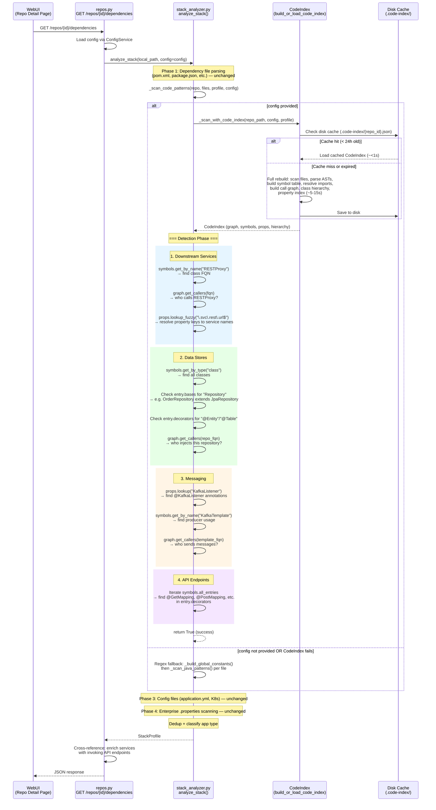

# Dependency Visualizer: CodeIndex Flow

How `analyze_stack()` uses the CodeIndex call graph to detect downstream
dependencies that regex cannot resolve (cross-file constant chains,
injected repositories, indirect HTTP client usage).

---

## Sequence Diagram



---

## The Key Improvement: Cross-File Resolution

The core problem regex cannot solve — and why the CodeIndex matters:

### Before (Regex): Single-file pattern matching

```
File A: OrderService.java
┌──────────────────────────────────────────────────────────────┐
│ RESTProxy.getInstance(serviceUrl)    ← regex sees "serviceUrl"
│ String serviceUrl = ChannelUtil.getChannelProperty(CONST)   │
│                                              ↑              │
│                                  regex looks for CONST here │
└──────────────────────────────────────────────────────────────┘

File B: ServiceConstants.java          ← REGEX CAN'T REACH THIS
┌──────────────────────────────────────────────────────────────┐
│ static final String CONST = "gws.mms.qp.token.svc.rest.url"│
└──────────────────────────────────────────────────────────────┘

Result: Detects "CONST" (raw name), not the actual service
```

### After (CodeIndex): Graph traversal + property resolution

```
SymbolTable          DependencyGraph           PropertyIndex
┌──────────────┐     ┌──────────────────┐      ┌────────────────────┐
│ RESTProxy    │◄────│ OrderService     │      │ "gws.mms.qp..."   │
│  .getInstance│     │   calls          │      │  → Constants.java  │
└──────────────┘     │   RESTProxy      │      │    line 42         │
                     └────────┬─────────┘      └──────────┬─────────┘
                              │                           │
    graph.get_callers() ──────┘      props.lookup_fuzzy()─┘

Result: "mms-qp-token" service detected with full chain
```

---

## CodeIndex APIs Used

| API | Purpose | Example |
|-----|---------|---------|
| `symbols.get_by_name(name)` | Find symbol by class/method name | `get_by_name("RESTProxy")` |
| `symbols.get_by_type("class")` | All class symbols | Find `@Entity` classes, `*Repository` interfaces |
| `symbols.get_by_fqn(fqn)` | Exact FQN lookup | Resolve caller identity |
| `symbols.get_by_file(path)` | All symbols in a file | Find annotation owners |
| `graph.get_callers(fqn)` | Reverse call graph | Who calls `RESTProxy.getInstance()`? |
| `props.lookup(name)` | Exact property lookup | Find `@KafkaListener` entries |
| `props.lookup_fuzzy(regex)` | Regex across property names | `\.svc\.rest\.url$` for service URLs |
| `entry.bases` | Base classes on SymbolEntry | Check if class extends `*Repository` |
| `entry.decorators` | Annotations on SymbolEntry | Check for `@GetMapping`, `@Entity` |

---

## Detection Strategy

### 1. Downstream Services

```
symbols.get_by_name("RESTProxy")
         │
         ▼
graph.get_callers(restproxy_fqn)  ──►  "OrderService calls RESTProxy"
         │
         ▼
props.lookup_fuzzy("\.svc\.rest\.url$")  ──►  Resolve property keys
         │                                      to readable service names
         ▼                                      e.g. "mms-qp-token"
_property_key_to_service_name(prop_key)
```

Searched HTTP client classes:
`RESTProxy`, `RestTemplate`, `WebClient`, `FeignClient`, `HttpClient`, `ChannelUtil`

### 2. Data Stores

```
symbols.get_by_type("class")
         │
         ├── entry.bases contains "Repository"?
         │        ▼
         │   entity_name = name.replace("Repository", "")
         │   graph.get_callers(repo_fqn)  ──►  Who injects this repo?
         │
         └── entry.decorators contains "@Entity" or "@Table"?
                  ▼
              Record entity with file location
```

### 3. Messaging

```
props.lookup("KafkaListener")  ──►  Find consumer annotations
props.lookup("SendTo")         ──►  Find producer annotations
props.lookup("JmsListener")    ──►  Find JMS consumers

symbols.get_by_name("KafkaTemplate")
         │
         ▼
graph.get_callers(template_fqn)  ──►  Who sends Kafka messages?
```

### 4. API Endpoints

```
for entry in symbols.all_entries:
    if "@GetMapping" in entry.decorators   ──►  GET endpoint
    if "@PostMapping" in entry.decorators  ──►  POST endpoint
    if "@RestController" in entry.decorators ──► Controller class
    ...
```

---

## Performance

| Scenario | Time | Notes |
|----------|------|-------|
| First run (no cache) | ~5-15s | Parallel I/O + AST parsing for ~5000 files |
| Subsequent runs (cached) | <1s | JSON deserialization from `.code-index/` |
| Graph traversal | ~10ms | O(edges) — near instant |
| Property resolution | ~5ms | Regex over in-memory index |
| Regex fallback | ~200ms | Per-file pattern matching (original behavior) |

- No LLM calls needed — pure graph traversal + property lookup
- Cache TTL: 24 hours (configurable via `code_index.max_age_hours`)

---

## Fallback Behavior

The system is designed to never regress:

```
_scan_code_patterns(repo, code_files, profile, config)
         │
         ├── config provided?
         │        │
         │        ├── YES → _scan_with_code_index()
         │        │              │
         │        │              ├── Success → return (skip regex)
         │        │              └── Exception → return False
         │        │                                    │
         │        └── NO ─────────────────────────────►│
         │                                             │
         ▼                                             ▼
    Regex fallback: _build_global_constants()
                    _scan_java_patterns() per file
                    _scan_python_patterns() per file
                    _scan_js_ts_patterns() per file
```

- `analyze_stack(repo_path)` — no config, regex only (backward compatible)
- `analyze_stack(repo_path, config=config)` — tries CodeIndex, falls back to regex
- If `build_or_load_code_index()` throws, catches the exception and returns `False`

---

## JISI Framework Detection (Phase 2.5)

For projects using the **JISI framework** (`com.chase.wasgwsframework`), an additional
XML-based scanning phase runs after Phase 2 (code patterns). This detects REST and SOAP
endpoints declared in servlet XML files — a pattern unique to JISI apps.

### Detection Flow

```
Phase 1: _map_dependencies()
         │
         ├── groupId == "com.chase.wasgwsframework"?
         │        ▼
         │   technologies["framework"] += "JISI (WAS GWS)"
         │
Phase 2: _scan_code_patterns()  ← unchanged
         │
Phase 2.5: is_jisi? → _scan_jisi_servlets(repo, profile)
         │
         ├── _find_servlet_xml_files(repo)
         │        │
         │        ├── *rest*servlet*.xml  → _parse_rest_servlet_xml()
         │        │        ▼
         │        │   <bean class="com.foo.BarController"/>
         │        │   → API endpoint (JISI REST) + downstream service
         │        │
         │        └── *cxf*servlet*.xml   → _parse_cxf_servlet_xml()
         │                 ▼
         │            <jaxws:endpoint implementor="com.foo.BazSvcImpl"/>
         │            → API endpoint (JISI SOAP) + downstream service
         │
         ├── _derive_service_name(bean_id, fqcn, protocol)
         │        ▼
         │   REST: BarController → BarRESTSvc
         │   SOAP: BazSvcImpl   → BazSvc
         │
Phase 3-4: Config + properties scanning ← unchanged
```

### Reused Parsers

The servlet XML parsers live in `src/bdd/servlet_discovery.py` (also used for BDD
service spec generation). The stack analyzer imports these functions directly:

| Function | Source | Purpose |
|----------|--------|---------|
| `_find_servlet_xml_files()` | `servlet_discovery.py:68` | Glob for `*rest*servlet*.xml` and `*cxf*servlet*.xml` |
| `_parse_rest_servlet_xml()` | `servlet_discovery.py:96` | Extract `<bean>` entries with Controller/Invoker/Resource classes |
| `_parse_cxf_servlet_xml()` | `servlet_discovery.py:132` | Extract `<jaxws:endpoint>` entries |
| `_derive_service_name()` | `servlet_discovery.py:174` | Convert FQCN to readable service name |

### Conditional Activation

The JISI scan only runs when `"JISI (WAS GWS)"` is present in `technologies["framework"]`,
which requires the Maven dependency `com.chase.wasgwsframework` in `pom.xml`. Non-JISI
repos skip this phase entirely — no behavior change.

---

## Files

| File | Role |
|------|------|
| `src/consciousness/stack_analyzer.py` | `_scan_with_code_index()`, `_scan_code_patterns()`, `analyze_stack()` |
| `src/api/routes/repos.py` | Loads config, passes to `analyze_stack()` |
| `src/code_index/storage.py` | `build_or_load_code_index()`, `CodeIndex` dataclass |
| `src/code_index/graph_builder.py` | `DependencyGraph` with forward/reverse edges |
| `src/code_index/symbol_table.py` | `SymbolTable` for FQN/name/file lookup |
| `src/code_index/property_index.py` | `PropertyIndex` for constant/field lookup |
| `src/code_index/hierarchy.py` | `ClassHierarchy` for parent/child classes |
| `src/bdd/servlet_discovery.py` | JISI servlet XML parsers (reused by stack analyzer Phase 2.5) |
